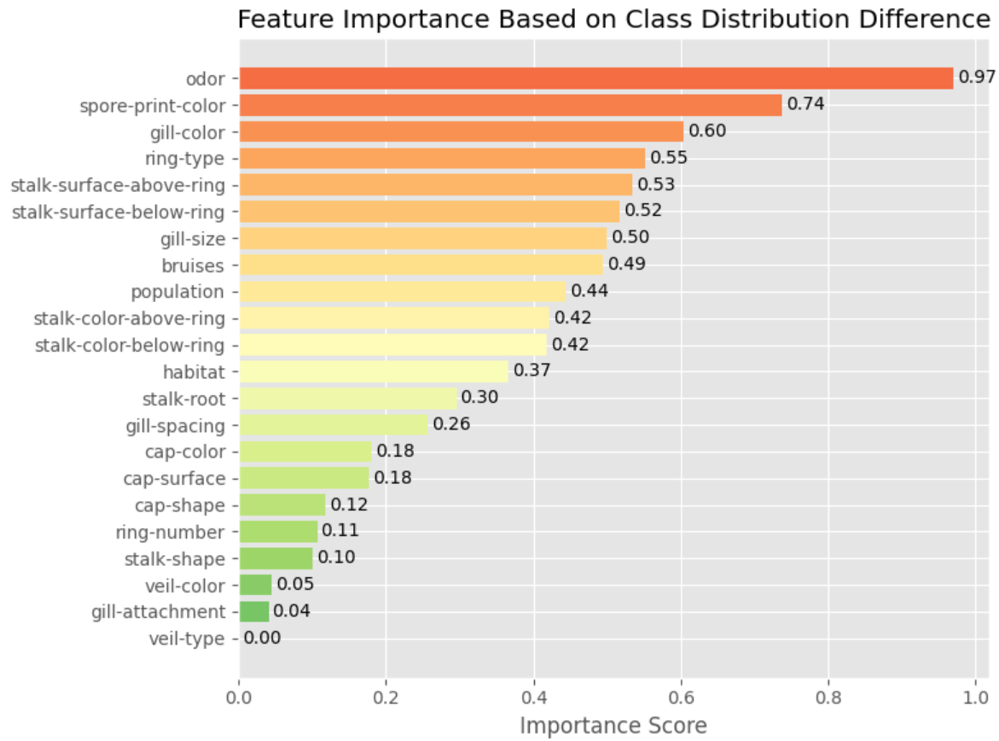
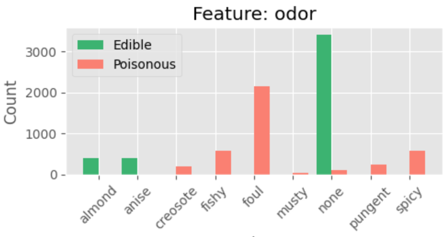
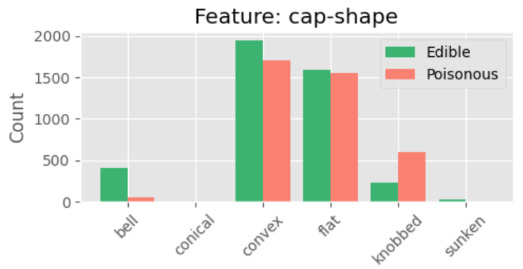
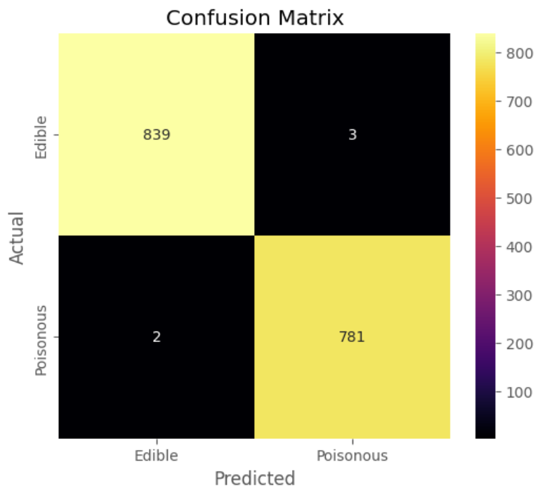

# Project Title

This repository holds an attempt to teach a machine to estimate whether or not a mushroom is poisonous from a list of 22 characteristics.

## Overview

The "Mushroom Classification" dataset does not come with a particular Kaggle Challenge. Instead, parameters from outside of the Kaggle site were set to create our own challenge. I trained a model to predict whether or not a mushroom was edible based on their physical characteristics. The approach in this repository was to formulate the problem as a binary classification task with the Logistic Regression model. Originally, the Random Forest Classifier model was used, but a consistent 100% accuracy rate. A simpler model, like Logistic Regression, was favored in the end product to ensure that the code did not have a source of data leakage. After extensive data cleaning, the Logistic Regression model with several important features removed had an accuracy score of 99.7%. Other submissions on the Kaggle site had similar success, ranging from 99% to 100% accuracies.

## Summary of Workdone

### Data and Clean-Up

In total, there were 8,124 mushrooms. 22 features of each mushroom were provided that responded to their physical characteristics, ranging from color, smell, size, shape, population trends, location, etc. There was no test training set provided, so I split the data into 80% (6499 data points) for training and 20% (1,625 data points) for testing. The `stalk-root` feature had several missing data points that were distinctly labelled with "?". I cleaned these up to be properly empty (NaN) data points. I removed the `veil-type` feature because all 8,124 data points full under the same category. After getting a perfect accuracy score with different models, I removed the `odor` feautre due to its high importance. Even after removing odor, the machine was still 100% accurate. I continued by removing two additional features of high importance, `spore-print-color`, and `gill-color`, in order to get a 99.7% accuracy rate.

#### Data Visualization

This "Importance Chart" ranks each feature on how much they differ between edible and poisonous mushrooms based on their value distributions.

For instance, `odor` was a very strong feature for differentiating between edible and poisonous mushrooms. Each category in every feature was almost exclusively full of only edible or only poisonous mushrooms.
 

On the other hand, `cap-shape` has several categories whose value distributions were very similar, such as having a convex, flat, or knobbed cap shape. This feature will be less helpful than others for my machine model to differentiate between classees.
 

### Problem Formulation

The input is a set of features corresponding to physical trait. The output is a binary label where 0 represents edible, and 1 represents poisonous. Originally, Random Forest was the model of choice, but the decision tree yielded a 100% accuracy rate and raised a concern of a faulty dataset. The Logistic Regression was favored due to being a simpler model and would provide a better metric to see if data cleanup was unsuccessful or if there was data leakage. I used scikit-learn's default solver, lbfgs, with an arbitrary seed value, 42, for reproducibility. No hyperparameter tuning was performed because the model already returned a high accuracy.

### Training

Training was performed in a jupyter notebook via Google Colaboratory with several imported packages: pandas, seaborn, matplotlib, and several sklearn packages. This project was completed on a standard Windows device. The dataset was small, so no GPU acceleration or trimming was required. Training only took a few seconds because Logistic Regression is a relatively simple model and the dataset was pretty small. The use of Logistic Regression trains the model without epochs, so there are no training curves to provide. Training stopped automatically because several test runs got 100% accuracy ratings.

I ran into several difficulties pertaining the suspiciously high accuracy of my machine. I eliminated several factors to make sure that everything was coded properly. Firstly, I simplified the model I used by swapping from a decision tree to Logistic Regression. This still resulted in a perfect accuracy rating, so I continued removing highly important features, like `odor`, `spore-print-color`, and `gill-color`, until I got an accuracy rate of 99.7%. I decided to not continue removing features, as this imperfect score guarantees that I did not make an error with my one-hot encoded class.

### Performance Comparison

The machine was able to predict the edibility of a mushroom 99.7% of the time, from 100% after switching models and removing several important features.
 

### Conclusions

The Mushroom Classification dataset is highly effective for training even the simplest models like Logistic Regression. It was able to reliably yield a 100% accuracy score, even after removing the single feature of highest distinction between classes, `odor`.

### Future Work

Because I confirmed that there was no error associated with my perfectly accurate machine, I feel safe returning to Random Forest classifier. Additionally, hyperparameter tuning could be done because we are no longer concerned about the unusually high accuracy rating.

Because this dataset has a large amount of features, testing for varying levels of toxicity would be a comfortable next step to move away from a simply binary classification task and begin a new study.

## How to reproduce results 

### Overview of files in repository

* DataVisualization.ipynb: Displays charts comparing the two classes across all 22 features and ranks features by importance.
* RandomForestMachine.ipynb: Trains a Random Forest model.
* LogisticRegressionMachine.ipynb: Trains a Logistic Regression model. 
The rest of the PNG files that are figures meant to use in this very markdown file.

### Software Setup

Google Colaboratory is recommended to reproduce this model because installing the necessary packages is not necessary and everything can be imported in a single or a few lines. TPU and GPU are also viable options, but Google Colab is more accessible.
If Google Colaboratory is not being used, then you must access these packages: seaborns, matplotlib, numpy, pandas, seaborn.

### Data

The data can be downloaded straight from this  website.

* There is no inherent missing data, but the `stalk-root` feature has some features labelled "?" that should be processed as missing data.
* Features that have almost perfect variance, like `odor`, should be dropped before training. Other features may be dropped. I only dropped them to make sure that the 100% accuracy score was not an error.
* Optionally, `veil-type` may be omitted because there is 0 distinction between the two classes for this category.
* Encode the edible (0) and poisonous (1) mushroom classes for binary classification.
* Split the dataset into 80% for training and 20% for testing.

### Training

Copy the data cleaning sections from my RandomForestMachine, and use the following code below to train your model.
* `from sklearn.ensemble import RandomForestClassifier`
* `rf_model = RandomForestClassifier(random_state=42)`
* `rf_model.fit(X_train, y_train)`
Like the previous seciton, use the data cleaning section from my LogisticRegressionMachine, and use this other code for training.
* `from sklearn.linear_model import LogisticRegression`
* `lr_model = LogisticRegression(random_state=42)`
* `lr_model.fit(X_train, y_train)`
Neither models require manual stopping and will end training immediately when necessary. Data was shuffled for randomization.

#### Performance Evaluation

Accuracy can be manually calculated, but you may have the machine automatically calculate it with this code:
`from sklearn.metrics import accuracy_score`
`accuracy = accuracy_score(y_test, y_test_pred)`
`print(f"Test Accuracy: {accuracy:.1f}")`

Additionally, an ROC plot could be created. Both of my models had AUC scores of 1.000.
`from sklearn.metrics import roc_curve, auc`
`y_probs = model.predict_proba(X_test)[:, 1]`
`fpr, tpr, _ = roc_curve(y_test, y_probs)`
`roc_auc = auc(fpr, tpr)`
`plt.plot(fpr, tpr, label=f'ROC Curve (AUC = {roc_auc:.3f})')`
`plt.plot([0, 1], [0, 1], linestyle='--')`
`plt.xlabel("False Positive Rate")`
`plt.ylabel("True Positive Rate")`
`plt.title("ROC Curve")`
`plt.legend(loc="lower right")`
`plt.grid()`
`plt.show()`

## Citations

* The [dataset](https://www.kaggle.com/datasets/uciml/mushroom-classification) used is in the public domain.

